```{r, include = FALSE, warning = FALSE, message = FALSE}
# load packages
library(lubridate)
library(tidyverse)
library(knitr)
library(ggpubr)

# read in data
df <- read_csv("data-by-day year 1.csv")

# clean data frame
df <- df %>%
  # looks like there's a bunch of NA rows so let's remove those 
  filter(if_all(everything(), ~ !is.na(.))) %>%
  # make all column names lower case
  rename_with(tolower) %>%
  # rename date column and make it a date object
  rename(date = date_of_interest) %>%
  mutate(date = mdy(date))
```


# Introduction
Publicly available data for COVID-19 collected by governments, healthcare facilities, and academic institutions has facilitated research on the evolution of the pandemic. In this study, we analyzed COVID-19 trends in each of the five boroughs of New York City (Bronx, Brooklyn, Manhattan, Queens, and Staten Island) using data collected by the New York Department of Health (NYDOH). The NYDOH dataset includes citywide and borough-specific daily counts of COVID-19 cases, hospitalizations, and deaths since February 29, 2020 (the day of the first laboratory-confirmed case in New York City). A subset of this data up to December 11, 2020 was included in our analyses. 

Figure 1 shows the citywide daily counts of COVID-19 cases, hospitalizations, and deaths from February 29 to December 11, 2020. We defined two pandemic waves in this time frame based on observations of daily cases: the first wave starts from February 29, 2020 and ends on September 14, 2020, in which a spike in cases was seen around April and dropped significantly until mid-September; the second wave starts on September 15 and is characterized by a resurgence of cases as winter approached.   

The Richard's growth function is a S-shaped function that is commonly used to model the growth of a population. Let $N(t)$ be a population at time $t$, the function takes the form:  

$$N(t) = \frac{a}{\{1 + d \exp\{-k(t-t_0)\}\}^{1/d}}$$
where $(a, k, d, t_0)$ are shape parameters. The parameter $a$ is the upper bound of the function; $k$ is the growth rate, which controls the slope at an inflection (where the curve changes from convex to concave); $t_0$ is the time at an inflection; and $d$ is another shape parameter that has no clear substantive meaning.

Let $t_i$ be the number of days since the beginning of a pandemic wave. Let $(y_i, t_i)_{i = 1, \ldots, n}$ be a sequence of observed daily cases/hospitalizations/deaths at time $t_i$. Let $Y_i = \sum_{k=1}^i y_k$ be the cumulative number of cases/hospitalizations/deaths by time $t_i$. We assumed that $(Y_i, t_i)$ follows the following non-linear model:

$$Y_i = N(t_i, \boldsymbol{\theta}) + \epsilon_i$$
where $N(t_i, \boldsymbol{\theta})$ is the Richard's growth function with parameters $\boldsymbol{\theta} = (a, k, d, t_0)^T$ and $\epsilon_i$ is the random error with mean zero, i.e. $E[\epsilon_i] = 0$. 

Our analysis was composed of three tasks. Task 1 developed a Newton-Raphson algorithm to fit a Richard's curve to each borough's cumulative cases. Task 2 then applied the same algorithm to each borough's cumulative hospitalizations and deaths. The fitted curves were compared across the five boroughs as well as the two pandemic waves. Lastly, Task 3 aimed to predict the trends (in cases, hospitalizations, and deaths) after December 11, 2020 for each borough in order to provide suggestions regarding the distribution of vaccination, which was authorized by the FDA on December 11.

```{r, echo = FALSE, warning = FALSE, message = FALSE}
fig_nyc_daily <- df %>%
  select(date:death_count) %>%
  # mutate(across(case_count:death_count, cumsum)) %>%
  pivot_longer(case_count:death_count, names_to = "type", values_to = "val") %>%
  ggplot(aes(x = date, y = val, color = type)) +
  geom_line() +
  scale_x_date(date_breaks = "1 month", date_labels = "%b") +
  scale_colour_discrete(name = "", labels = c("Case", "Death", "Hospitalization")) +
  labs(x = "Date", y = "Daily count") +
  geom_vline(xintercept = as.Date("2020-09-15"), alpha = 0.4, linewidth = 1) +
  theme_bw()
```

```{r, echo = FALSE, fig.cap = "Daily counts of COVID-19 cases, hospitalizations, and deaths in New York City"}
fig_nyc_daily
```

# Task 1

Our goal for Task 1.1 was to develop a Newton-Raphson algorithm to fit Richard curves to each NYC borough's cumulative number of cases for a pandemic wave. We used a simple gradient descent algorithm that aims to minimize the sum of squared errors (SSE), $h(\boldsymbol{\theta})$. 

Since $E[Y_i] = N(t_i, \boldsymbol{\theta})$, then $h(\boldsymbol{\theta})$ is defined as:

$$
\begin{aligned}
h(\boldsymbol{\theta}) 
&= \sum_{i=1}^n(Y_i -  N(t_i, \boldsymbol{\theta}))^2 \\
&= \sum_{i=1}^n \left[Y_i - a \left\{1 + d\exp\left\{-k(t_i-t_0)\right\}\right\}^{-1/d}\right]^2
\end{aligned}
$$

The gradient of $h(\boldsymbol{\theta})$, $\nabla h(\boldsymbol{\theta})$, is calculated as:

$$
\begin{aligned}
\nabla h(\boldsymbol{\theta})
 &= -2 \sum_{i=1}^n [Y_i - N(t_i,\boldsymbol{\theta})]\cdot \nabla N(t_i,\boldsymbol{\theta}) \\
 &= -2 \sum_{i=1}^n [Y_i - N(t_i,\boldsymbol{\theta})]\cdot 
 \left(
 \frac{\partial N(t_i,\boldsymbol{\theta})}{\partial a}, 
 \frac{\partial N(t_i,\boldsymbol{\theta})}{\partial k}, 
 \frac{\partial N(t_i,\boldsymbol{\theta})}{\partial d}, 
 \frac{\partial N(t_i,\boldsymbol{\theta})}{\partial t_0}
 \right)^T 
\end{aligned}
$$

where 

$$
\begin{aligned}
\frac{\partial N(t_i,\boldsymbol{\theta})}{\partial a} &= \frac{1}{(1 + d e^{-k(t-t_0)})^{1/d}}\\
\frac{\partial N(t_i,\boldsymbol{\theta})}{\partial k} &= \frac{a (t-t_0) e^{-k(t-t_0)}}{(1 + d e^{-k(t-t_0)})^{1+1/d}} \\
\frac{\partial N(t_i,\boldsymbol{\theta})}{\partial d} &= -\frac{a(e^{-k(t-t_0)}d - \text{ln}(1+e^{-k(t-t_0)}d)(1 + e^{-k(t-t_0)}d))}{d^2(1 + d e^{-k(t-t_0)})^{1+1/d}} \\
\frac{\partial N(t_i,\boldsymbol{\theta})}{\partial t_0} &= -\frac{ak e^{-k(t-t_0)}}{(1 + d e^{-k(t-t_0)})^{1+1/d}}
\end{aligned}
$$

Our gradient descent algorithm can be summarized as follows:

1. Set $\boldsymbol{\theta}_0$, the starting values for $\boldsymbol{\theta}$ (see later in this section for more details on how to pick these). 
2. Update $\boldsymbol{\theta}$ based on $\boldsymbol{\theta}_{j} = \boldsymbol{\theta}_{j-1} - \lambda \cdot I_{4 \times 4} \nabla h(\boldsymbol{\theta}_{j-1})$, where $\lambda$ is a user-chosen learning rate (setting $\lambda$ is to a small value, such as $1^{-10}$, works well for this data).
3. If $h(\boldsymbol{\theta}_j) \geq h(\boldsymbol{\theta}_{j-1})$, then decrease the learning rate further and recalculate $h(\boldsymbol{\theta}_j)$, replacing $\lambda$ with $\frac{\lambda}{10}$. Continue repeating this step until $h(\boldsymbol{\theta}_j) < h(\boldsymbol{\theta}_{j-1})$, i.e. until there is a decrease in SSE from the previous iteration.
4. Continue repeating steps 3 and 4 until convergence is reached, i.e. when the absolute difference between $h(\boldsymbol{\theta}_j)$ and $h(\boldsymbol{\theta}_{j-1})$ is smaller than a very small tolerance level.

Although our algorithm is not the most efficient algorithm, it has two main advantages. One, it is simple to compute and does not rely on the calculation of the Hessian, which is complicated. Two, using the symmetric and positive definite matrix $I_{4 \times 4}$ as a replacement for the Hessian guarantees that we have a descent direction. This means that we will be able to find some $\lambda \in (0, 1)$ that ensures that the updated $\boldsymbol{\theta}_j$ has a smaller SSE than the previous iteration's $\boldsymbol{\theta}_{j-1}$.

In step 1 of the algorithm, the user is required to choose the starting values, $\boldsymbol{\theta}_0$. We found that poor choices of $\boldsymbol{\theta}_0$ resulted in non-convergence or incorrect convergence issues. Choices of $\boldsymbol{\theta}_0$ based on the observed cumulative cases for the borough and the epidemiological interpretations of the Richard growth parameters resulted in fast convergence and good final estimates of $Y_i$. Our guidelines for how to tailor the starting values for each borough and wave are as follows:

* Since $a$ is the upper bound of the Richard growth function, then let its starting value be the maximum number of cumulative cases in the pandemic wave. For the first wave, this is easily calculated as $\mbox{max}(Y_i)$. For the second wave, since we only have observed data for the first half of the wave (i.e. up until about the inflection point), we must estimate what the maximum number of cumulative cases will be. We recommend using about $2 \times \mbox{max}(Y_i)$ under the assumption that half of the maximum cumulative cases occurs at the inflection point. We made this assumption because we saw this trend across the boroughs in the first wave and assumed that the second wave would follow a similar pattern.

* Since $t_0$ is the time of inflection, then let its starting value be the time $t_i$ where the inflection point occurs. This can be chosen as the point where the curve goes from convex to concave based on a plot of $Y_i$ against $t_i$. Note that for the second wave, since we only have observed data for the first half of the wave, this point will occur towards the end of the observed data.

* Since $k$ is the growth rate that controls the slope at the inflection point, then let its starting value be calculated as the slope at the inflection point $t_0$ standardized by the cumulative cases at the inflection point: $\frac{(Y_{i,t_0 + m} - Y_{i,t_0 - m})/[(t_0 + m) - (t_0 - m)]}{Y_{i,t_0}}$, where $Y_{i,t_0 - m}$ and $Y_{i,t_0 + m}$ are the cumulative cases corresponding to $m$ days before and after the inflection point, respectively, $Y_{i,t_0}$ is the cumulative cases corresponding to the inflection point, and $(t_0 + m) - (t_0 - m)$ is a small range around the inflection point. This can easily be computed by using two points around the inflection point to fit a linear regression, regressing $Y_i$ on $t_i$.

* Since $d$ has no epidemiological interpretation, picking its starting value is tricky. We found that values between 0 and 0.5 worked well. However, we advise investigators to try a few different values for $d$ and pick what works best.

Figure XXX gives an example of how a starting curve for Wave 1 data on NYC would look, compared to the final fitted curve. We can see that the starting curve follows the general trend of the observed cumulative cases, but the final curve obtained from running our algorithm fits the observed data much better. We also note that from about $t_i = 100$ to $t_i = 200$ of the first wave, the observed cumulative cases follow a linear trend, so we would expect that our final Richard growth curve will never be able to fit the observed data very well in this portion of the wave since the Richard growth function assumes a sigmoidal shape.

The algorithm described in this section was also used in Task 1.2 to fit Richard curves to each NYC borough's cumulative number of hospitalizations and deaths for each pandemic wave. 


```{r, echo = FALSE}
# function to calculate difference in number of days between two dates
get_diff <- function(x,y) time_length(x %--% y, unit = "day")
# function to calculate N(t_i, theta)
N <- function(t_i, theta) {
  a <- theta[1]
  k <- theta[2]
  d <- theta[3]
  t0 <- theta[4]
  a * (1 + d * exp(-k * (t_i - t0)))^(-1/d)
}

# we'll just use the city-wide, first-wave data for our cum case count input into the algo
start_date <- "2020-02-29"
end_date <- "2020-09-14"
df_wave <- df %>%
  filter(date >= start_date & date <= end_date) %>%
  select(date:case_count) %>%
  mutate(
    t_i = get_diff(start_date, date),
    Y_i = cumsum(case_count)
  ) %>%
  select(!case_count)

# # look at cumulative cases over the wave 
# df_wave %>%
#   ggplot(aes(x = t_i, y = Y_i)) +
#   geom_point(size = 1) +
#   geom_point() +
#   xlab("Days (since Feb 29, 2020)") +
#   ylab("Cumulative cases") +
#   theme_bw()

# figure out starting parameters
# a is just the maximum number of cumulative cases in the wave
a_start <- max(df_wave$Y_i)
# t0 can be some t_i near the inflection point
infl_point <- "2020-04-04"
t0_start <- get_diff(start_date, infl_point)
# k can be the slope near the inflection standardized by the cumulative cases near inflection point 
lm_k <- lm(
  Y_i ~ t_i, data = df_wave %>% 
    filter(t_i %in% c(t0_start - 4, t0_start + 4))
)
standardize <- df_wave %>% filter(t_i == t0_start) %>% pull(Y_i)
k_start <- lm_k$coef[2] / standardize
# d can just be 0.5 
d_start <- 0.5
# set starting theta vector
start <- c(a_start, unname(k_start), d_start, t0_start)

# look at Y_hat based on the starting theta vector
# df_wave %>%
#   mutate(Y_i_hat = N(t_i, start)) %>%
#   ggplot(aes(x = t_i)) +
#   geom_point(aes(y = Y_i), size = 1) +
#   geom_line(aes(y = Y_i_hat), color = "red") +
#   geom_vline(xintercept = t0_start, color = "blue") +
#   theme_bw()

# function to calculate objective f'n (sse) and its gradient
sse_stuff <- function(df_wave, theta) {
  a <- theta[1]
  k <- theta[2]
  d <- theta[3]
  t0 <- theta[4]
  t <- df_wave$t_i
  Y <- df_wave$Y_i
  Y_hat <- N(t, theta)
  # calculate objective function f
  diff <- Y - Y_hat
  f <- sum(diff^2)
  # calculate gradient for N(t,theta)
  da_N <- (1 + d * exp(-k*(t-t0)))^(-1/d)
  dk_N <- (a * (t-t0) * exp(-k*(t-t0))) / (1 + d * exp(-k*(t-t0)))^(1 + 1/d)
  dd_N <- -a * (d * exp(-k*(t-t0)) - log(1 + d*exp(-k*(t-t0))) * (1 + d * exp(-k*(t-t0)))) / 
    (d^2 * ((1 + d * exp(-k*(t-t0)))^(1 + 1/d)))
  dt0_N <- - (a * k * exp(-k*(t-t0))) / (1 + d * exp(-k*(t-t0)))^(1 + 1/d)
  # calculate gradient for objective function f
  grad_f <- c(-2 * sum(diff*da_N),
              -2 * sum(diff*dk_N),
              -2 * sum(diff*dd_N),
              -2 * sum(diff*dt0_N))

  res <- list(f = f, grad = grad_f)
  return(res)
}

# df_wave: data frame of t_i, Y_i for the wave of interest
# start: starting theta vector
# tol: tolerance needed to stop iterating
# maxiter: max number of iterations 
NewtonRaphson <- function(df_wave, start, tol = 1e-5, maxiter = 10000) {
  # set up
  i <- 0
  cur <- start
  stuff <- sse_stuff(df_wave, cur)
  res <- matrix(0, nrow = 1, ncol = 7)
  colnames(res) <- c(
    "i", "lambda", "sse",
    "a", "k", "d", "t0"
  )
  res[1,] <- c(0, 1, stuff$f, cur)
  prevf <- -Inf   
  # begin iterating to update current theta vector
  while(i < maxiter && abs(stuff$f - prevf) > tol){
    i <- i + 1
    prev <- cur
    prevf <- stuff$f
    prevgrad <- stuff$grad
    # set lambda to start off
    lambda <- 1e-10
    # calculate new values where lambda = 1 
    cur <- prev - lambda * prevgrad
    stuff <- sse_stuff(df_wave, cur)
    # continue to decrease lambda until we see a decrease in SSE
    while(stuff$f >= prevf | any(is.na(stuff$grad))) {
      # divide lambda
      lambda <- lambda / 10
      # calculate new values at the updated lambda value and its corresponding information
      cur <- prev - lambda * prevgrad
      stuff <- sse_stuff(df_wave, cur)
    }
    res <- rbind(res, c(i, lambda, stuff$f, cur))
  }
  return(res)
}
# run on first wave full NYC data
res <- suppressWarnings(NewtonRaphson(df_wave, start))
final <- res[nrow(res), 4:7]

# plot results of starting and final curve
p_nyc_start_final <- df_wave %>%
  mutate(
    Start = N(t_i, start),
    Final = N(t_i, final)
  ) %>%
  pivot_longer(Start:Final, names_to = "type", values_to = "value") %>%
  mutate(type = factor(type, levels = c("Start", "Final"))) %>%
  ggplot(aes(x = t_i)) + 
  geom_point(aes(y = Y_i), size = 1) +
  geom_line(aes(y = value, color = type)) +
  ylab("Cumulative cases") +
  xlab("Days (since Feb 29)") +
  labs(color = "Fitted model") +
  theme_bw()

# create table comparing starting values to final values
t_nyc_start_final <- cbind(rbind(start, final) %>% round(digits = 3)) %>%
  data.frame() %>%
  ggtexttable(
    theme = ttheme(base_style = "light")
  ) 

fig_nyc_start_final <- ggarrange(p_nyc_start_final, t_nyc_start_final, ncol = 1, nrow = 2, heights = c(10, 3))
```

```{r, echo = FALSE, fig.cap = "Example for Wave 1 NYC data comparing starting values and starting curve to the final values and fitted curve obtained from our algorithm."}
fig_nyc_start_final
```


# Task 2

## Cumulative Cases

We first present the results for cumulative cases in all boroughs to investigate the algorithm performance. The two COVID-19 waves are defined as follows: waves 1: February 29, 2020 to September 14, 2020; wave 2: September 14, 2020 to December 11, 2020. 

As discussed in the previous section, the starting values are chosen based on the following guidelines:  

* $a = \text{max}(Y_i)$;
* $t_o \approx \text{argmax}(Y_i)$;
* $k$ is the standardized slope for cumulative cases 4 days before and after inflection date. 
* $d$ is 0.5


In the first figure, we present the fitted curves (red) and compare the true cumulative cases (black). From a direct observation, we conclude that the algorithm performed well in approximating the real data. 

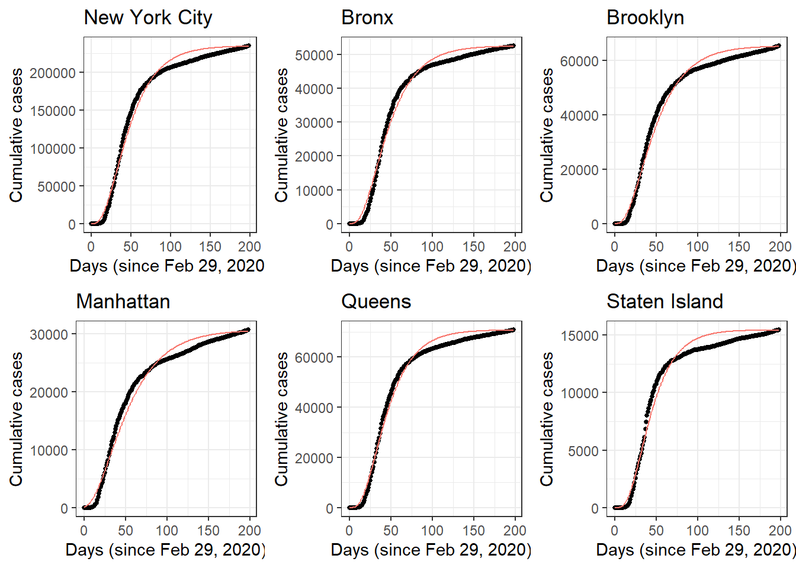{width=400px}

We further present the estimates parameters for the first wave cumulative cases. Since we have access to the first wave data, the estimated parameters can serve as a validation for the algorithm performance. By a direction observation of estimated $a,t_0$ parameters, we conclude our algorithm performed well since the estimated parameters approached the truth well. 

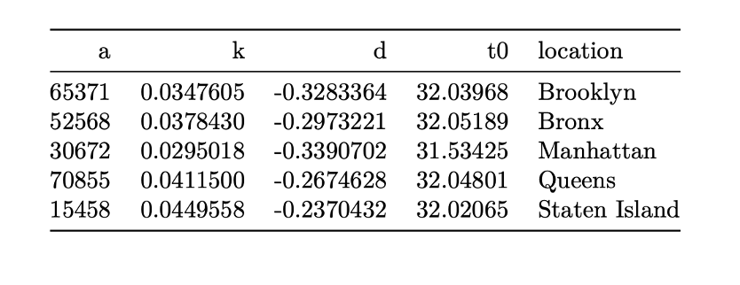{width=400px}

We then present the fitted curves and estimated parameters for the second wave cumulative cases. Since we only obtained partial data for second wave, several assumptions about starting values are made for the estimation. 

* We first assume the inflection point $t_0$ is at around the end of the observed data
* $a = 2*y_{t0}$ with the assumption that the maximum number of cumulative cases will be two times the case number at the inflection point 
* $k$ is the standardized slope for cumulative cases 4 days before and after inflection date. 
* $d$ is 0.5

From the blow figure and estimated parameters, we notice a good recovery of the true cases cruves with our estimated curves in all boroughs.

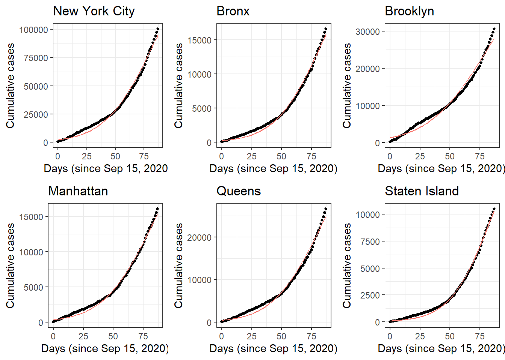{width=400px}

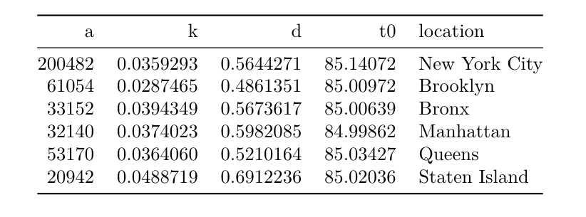{width=400px}
 


## Cumulative Hospitalizations
We fit the Richard's growth curve for cumulative hospitalizations in all boroughs in NYC. Similar to case observations, we split hospitalizations into two waves: 1) February 29, 2020 to September 14, 2020; 2) September 14, 2020 to December 11, 2020. 

When fitting the first wave of hospitalizations, we use the following assumptions to pick starting values:

* $a$ is $\mbox{max}(Hospitalizations)$ for all boroughs and NYC, assuming there is not much increase in hospitalization counts or health resources to accommodate patients after the curve levels out. 
* Different inflection date $t_0$ for different locations, as we observe slopes at different dates fit observations better. There are minor differences among inflection dates. Brooklyn and Manhattan have March 31 as starting value for inflection date; Staten Island has April 1; Queens, Bronx, and NYC have April 3, 2020.
* $k$ is the standardized slope for cumulative hospitalization data on 4 days before and after inflection date. 
* $d$ is 0.5

Figure ? are plots for fitted curve for the first hospitalization wave. Figure ? are the parameters used to fit the first wave. 

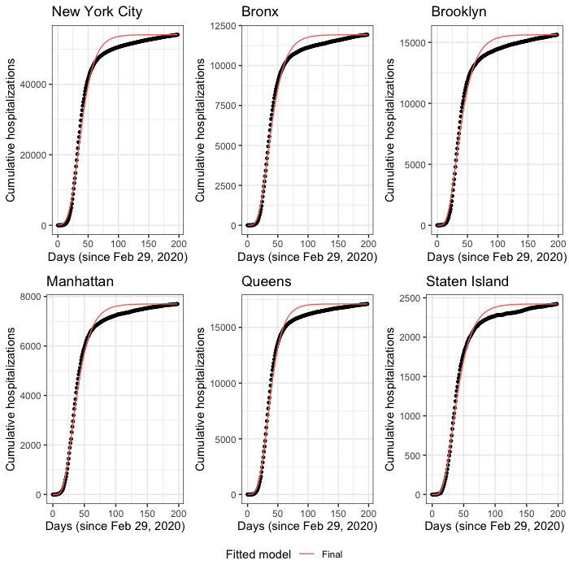{width=400px}

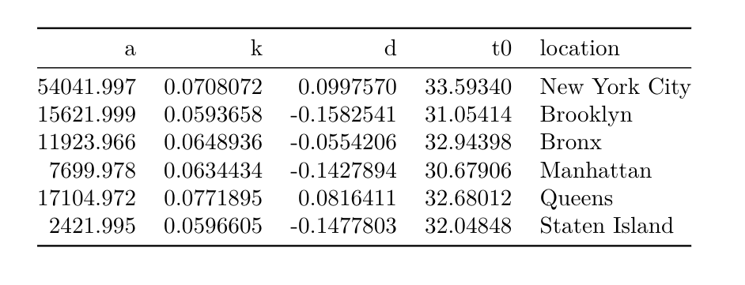{width=400px}

The fit is very close to the observations in all locations. The fitted curve is overestimating hospitalizations around the dates that the curve starts to level out. However, since healthcare resources were extremely limited during the outbreak of the pandemic, it is safe to overestimate than underestimate hospitalization counts. The final fitted $t_0$ for all locations are indeed a couple of days apart, corresponding to our initial belief. 

Observed hospitalization in the second wave seems to be the first half of a regular Richard's growth curve. We do see a gradual increase and then more rapid increase in hospitalization during this period of time. The changes in slopes are tricky to model this time. For the second wave of hospitalization, the initial values are decided as the following: 

* $a$ is $2.2 \times \mbox{max}(hospitalization)$ for all boroughs and NYC, assuming that half of the maximum hospitalization occurs at the inflection point.
* December 9, 2020 as $t_0$ for all locations.
* $k$ is the standardized slope for cumulative hospitalization data on 2 days before and after inflection date due to rapid change in hospitalizations around our assumed inflection date.
* $d$ is 0.25 for Staten Island and 0.5 for all other locations.

Figure ? are plots for fitted curve for the second hospitalization wave. Figure ? are the parameters used to fit the second wave. 

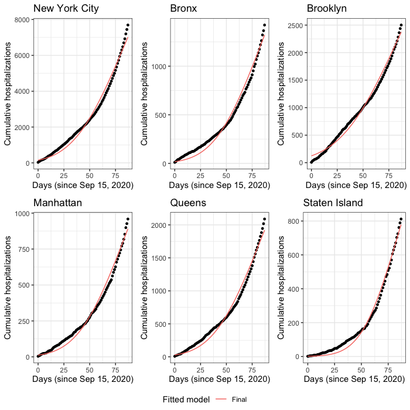{width=400px}

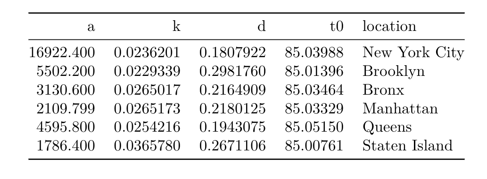{width=400px} 

The fitted curves still look very close to the observation. We tend to underestimate when the observed hospitalization is mildly increasing, and overestimate when the speed of the observed increase is growing. The estimate values for growth rate parameter $k$ reflect how different the slope changes in each borough. 

## Cumulative Deaths

# Task 3

## Cumulative Cases
From previous task, we successfully estimated and obtained parameters that approximated the first half of the second wave data well. A natural extrapolation would be extending the curves so that we may predict the cumulative cases based on th observed the data. Hence, we utilize the estimated final parameters and use that for cumulative cases prediction. 

We incorporate borough population to infer cases per 100,000 capita so that based on the y axis we are able to make a direct comparison of the severity of the second wave. Based on the interpretation of the estimated parameters, we obtained the following observations:

* $a$ can be interpreted as maximum number of cumulative cases in each borough. Staten Island is predicted to have the largest cases per 100,000 capita and Manhattan is predicted to have the smallest
* $k$ can be interpreted as standardized slope at the inflection point. It Provides intuition of the rate of cases increase at inflection point. Staten Island has biggest $k$ while Brooklyn has smallest $k$. 

Therefore, based on the previous prediction and observation, we would suggestion that distributing vaccination to the boroughs with higher predicted cumulative cases per capita and large rate of cases increase. In this case, Staten Island should be prioritized for vaccination rollout. 


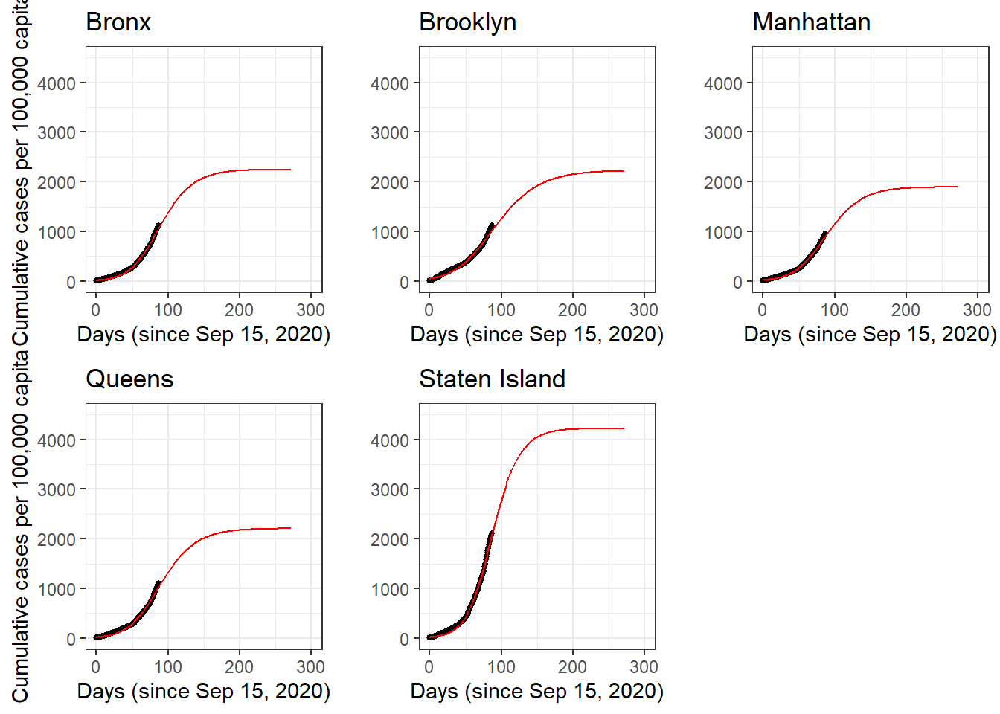{width=400px} 

{width=400px}


## Cumulative Hospitalizations

We used the parameters in the fit for second wave of cumulative hospitalizations to make long-term predictions and hope to draw insight on vaccine distribution from the predicted curve.

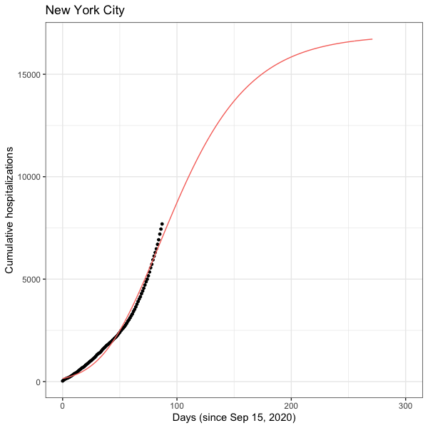{width=400px} 

To make our predictions more comparable, we plotted predicted cumulative hospitalizations per 100,000 capita for each borough. 

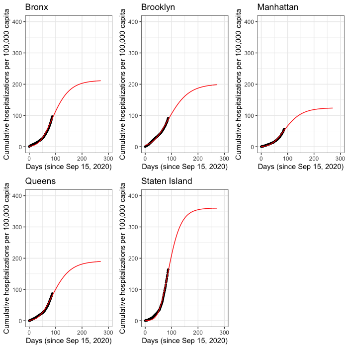{width=400px} 

Unfortunately, Staten Island has the highest predicted cumulative hospitalizations per 100,000 capita and its predicted growth rate is the highest.

Bronx and Manhattan both have the second highest predicted growth rate. But Bronx has the higher predicted hospitalizations per 100,000 capita. 

Even though growth rate and predicted hospitalization per 100,000 capita are different for each borough, the predicted inflection date is almost the same for all boroughs. $t_0 = 85$ corresponds to December 9, 2020. This date is also very similar to the predicted inflection date for cumulative cases. This could be a result of rapid disease progression, as some people who were contracted need to be hospitalized immediately. 

COVID-19 vaccines first became available in the US on December 14, 2020 according to U.S. Department of Health & Human Services. Therefore, while prioritizing hot spots such as Staten Island and Bronx, the government should also prepare enough inventory to meet needs city-wide to provide maximum protection against COVID-19 due to its rapid disease progression.


## Cumulative Deaths


# Conclusions
